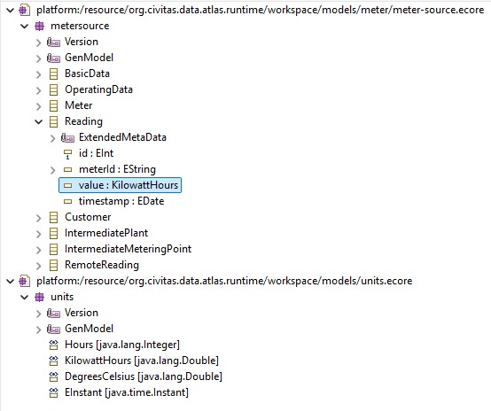
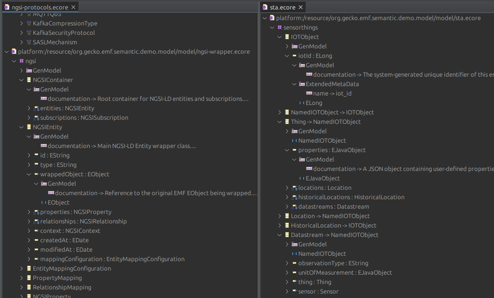
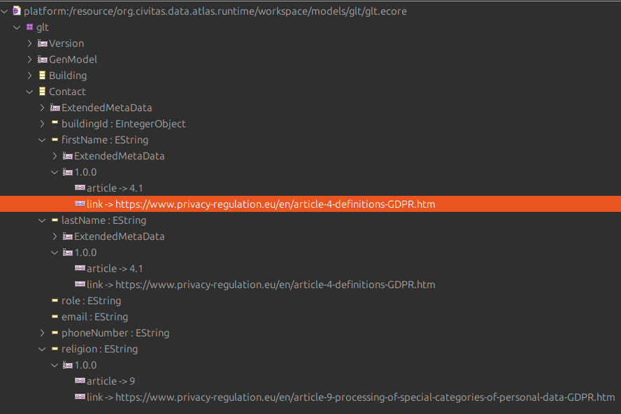
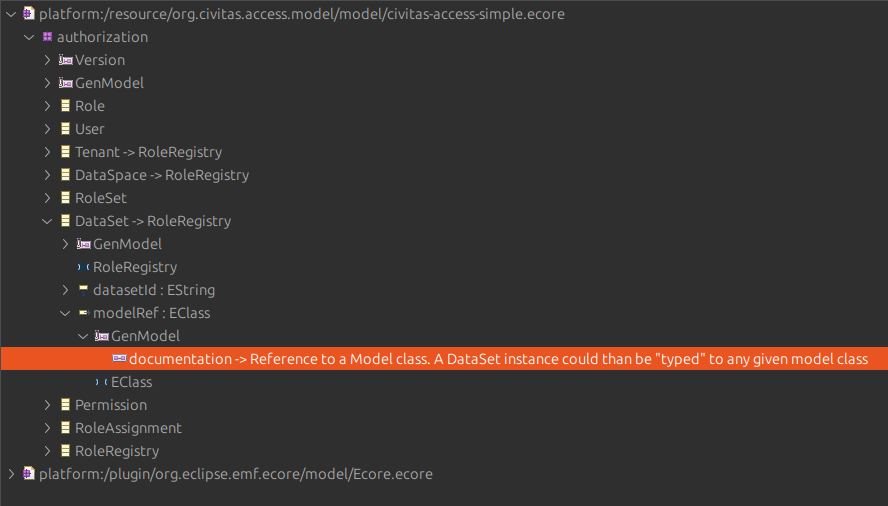

# Stellungnahme zu den Anforderungen des Prototyps

Dieses Dokument beschreibt, wie die Anforderungen des Proof of Concept (PoC) "modelling-technology" mit dem gewählten Technologie-Stack, bestehend aus **EMF/Ecore** für die Modellierung, Java und **OSGi** für die modulare Architektur und **QVT** für Transformationen, erfüllt werden.

### Kernanforderungen an Modelle & Transformationen

**1. Models should be intrinsically documented (‘self-explanatory’)**

- **Antwort:** Durch die Verwendung von Ecore sind die Modelle systemimmanent und formal dokumentiert. Die Struktur, Datentypen, Kardinalitäten, Hierarchien und Beziehungen sind explizit im Meta-Modell definiert und maschinenlesbar. Dies minimiert die Notwendigkeit externer Dokumentation und macht die Modelle selbsterklärend. Mittels Annotationen können den Modellelementen weitere Meta-Informationen hinzugefügt werden. 

**2. It should be possible to define Metamodels**

- **Antwort:** Dies ist eine Kernstärke von EMF/Ecore. Wir definieren für alle relevanten Domänen (z.B. Datenmodelle, Transformationsmodelle, Konfigurationsmodelle, Datenschutzmodelle) explizite Ecore-Metamodelle. Diese dienen als "Sprache" und Schema für die jeweiligen Fachmodelle und ermöglichen deren Validierung.

**3. Metamodel expressiveness**

- **Antwort:** Ecore ist sehr ausdrucksstark und erlaubt die präzise, verlustfreie Abbildung von Domänen. Durch OCL (Object Constraint Language) können zusätzlich komplexe Regeln und Validierungseinschränkungen direkt im Metamodell definiert werden. Die reflektiven Eigenschaften von EMF stellt sicher, dass alle Beziehungen und Elemente zur Laufzeit zugänglich sind.

**4. Support of arbitrary data models (01.12)**

- **Antwort:** EMF/Ecore ist explizit dafür konzipiert, beliebige Datenmodelle zu erstellen. Nutzer können eigene Ecore-Modelle definieren und somit die Struktur, Typisierung und Benennung ihrer Daten vollständig frei gestalten. Der Ansatz orientiert sich direkt an Standards wie EMOF, auf dem auch UML basiert. Bezüglich eines Datensatz / Datenpunktmodells existieren viele Freiheitsgrade (Spezialisierung, Vererbung, Komposition, Aggreagation).

**5. Reusability of models**

- **Antwort:** Ecore-Modelle sind inhärent wiederverwendbar. Sie können über Packages importiert und erweitert werden. Vererbung zwischen Modellelementen ist ein Standard-Feature. Die Modelle können über standardisierte Formate wie XMI (XML Metadata Interchange) ausgetauscht werden. Eine Cross-Document-Rerenzierung ist möglich. So kann eine Referenz in einer XMI Datei auf eine Web-URI verweisen, um seine Daten aufzulösen.

**6. It should be possible to change models at runtime**

- **Antwort:** Die Architektur unterstützt dies auf zwei Ebenen:
  1. **Modell-Instanzen (Daten):** EMF-Modelle (die Daten / Eobjects) können zur Laufzeit dynamisch erstellt, geladen, modifiziert und persistiert werden. Dies deckt den "ständigen" und "häufigen" Änderungsbedarf ab.
  2. **Anwendungslogik:** Durch die Model-Registry Logik in EMF können Modelle zur Laufzeit aktualisiert, hinzugefügt oder entfernt werden, ohne die gesamte Plattform neu starten zu müssen.

**7. Versioning and change management of models**

- **Antwort:** Ecore-Modelle und QVT-Transformationen sind textuelle Artefakte (meist XML/XMI), die hervorragend mit Standard-Versionskontrollsystemen wie Git verwaltet werden können. Für komplexeres Management können Tools wie EMF Compare zur Erkennung von Unterschieden und zum Mergen von Modellen eingesetzt werden. Zudem basiert die Indentifikation von Modellen / Packages auf Namespace-URI’s. Diese können ebenfalls ein Versionssegment enthalten.

**8. Data transformation (01.18)**

- **Antwort:** Für Modell-zu-Modell-Transformationen setzen wir auf den OMG-Standard QVT (Query/View/Transformation). Dies erlaubt die regelbasierte Überführung von Quelldaten (z.B. aus Konnektoren) in ein Zielmodell-Instanzen.
- Die eingehenden und ausgehenden Modelle können beliebige Ecore-Modelle sein.
- Eine Blackbox-Integration ermöglicht das Ausführen von Java-Code, um Sonderfälle abdecken zu können. Blackboxes sind Bestandteil der QVT Transformationen und sind in die Sprache integriert.

**9. Transformation of the internal data model (01.27")**

- **Antwort:** Analog zu Punkt 8 kann QVT verwendet werden, um das interne Datenmodell in die Zieldatenmodelle externer Schnittstellen zu transformieren. QVT kann beliebige Ecore Modelle verwenden, inklusive sich selbst.

**10. Describe the transformation as a model**

- **Antwort:** QVT-Definitionen sind selbst Ecore-Modelle. Sie beschreiben deklarativ die Beziehungen zwischen Quell- und Ziel-Metamodellen. Dies entspricht exakt der Anforderung. QVT ist in dem Sinne ein spezielle Domain Specific Language für Datentransformationen

**11. Execute Transformations efficiently**

- **Antwort:** QVT-Engines sind für die Ausführung im selben Prozess optimiert. Die Transformationslogik läuft innerhalb von Java. Transformatoren sind konfigurierbar und benötigen die URI zu ihrem Script. 
- In einer Umgebung können mehrere Transformatoren mit unterschiedlichen Scripten laufen. Damit skaliert man die Transformationsprozesse innerhalb einer Java-VM bspw. per Konfiguration. 
- Die QVT Implementierung der Eclipse Foundation ist ein Bibliothek, die sowohl in normalen Java als auch in OSGi Umgebungen funktioniert

**12. Execute transformations on the fly or lazily**

- **Antwort:** Die Transformations-Engine kann sowohl ereignisbasiert (on the fly) als auch zeitgesteuert als Stapelverarbeitung (lazy/eager) im Java Code getriggert werden. Dies kann wie im POC innerhalb einer Workflow-Engine (wie bspw. Camel) geschehen. 
- QVT beherrscht auch das tranformieren von Input Batches (Objektlisten)
- Die QVT Implementierung der Eclipse Foundation ist ein Bibliothek, die sowohl in normalen Java als auch in OSGi Umgebungen funktioniert

**13. Condition-based transformations**

- **Antwort:**QVT unterstützt Guards und Bedingungen (oft mittels OCL), sodass Transformationsregeln nur dann ausgeführt werden, wenn bestimmte Konditionen im Quellmodell erfüllt sind.
- Daneben beherrscht QVT fundmentale Kontrollstrukturen wie if-then-else

**14. Rule based transformation of content**

- **Antwort:** QVT ist ein regelbasiertes System. Jede Regel definiert, wie ein Element des Quellmodells in ein oder mehrere Elemente des Zielmodells transformiert wird, inklusive der Manipulation von Attributwerten.
- Regeln können in eigenen Bibliotheken ausgelagert und in Transformationsscripte importiert werden und erhöhen damit die Wiederverwendbarkeit des Code

**15. Transformation of attributes (01.19)**

- **Antwort:** Dies sind Standardoperationen in QVT. Das Umbenennen, Typ-Casting, Verschieben und Entfernen von Attributen gehört zu den Grundfunktionen der Transformationssprache.
- Neben diesen Operation kann QVT auch komplexe strukturelle Transformationen zwischen Objekten durchführen (z.B. zwei Eingangs-Objekte werden zu einem Ausgangsobjekt zusammengefügt)

### Datenmanagement & Konnektivität

**16. Single source of truth for datasets (01.17)**

- **Antwort:** Das System verwaltet die Datenmodelle und ihre Instanzen zentral. Der Model-Atlas der auf dem EMF basiert implementiert exakt diese Single-Source-of-truth. Er ist als prototypische Komponente im POC enthalten. 
- Er zeigt die Modelle als XMI, Json-Schema hat Endpunkte für Dokumentation (Mermaid) sowie einfachen examplarischen Datenschutz.

**17. Merging of datasets (01.15)**

- **Antwort:** Wird durch Transformationslogik erfüllt. Das Zusammenführen von Datensätzen kann über eine QVT-Transformation realisiert werden, die mehrere Quellmodelle liest und ein fusioniertes Zielmodell erzeugt (siehe Punkt 15).

**18. Referencing other data sets**

- **Antwort:** EMF/Ecore unterstützt standardmäßig Referenzen (E-References) zwischen Objekten, auch über die Grenzen von Ressourcendateien / Dokumenten hinweg. Dies ermöglicht die Verknüpfung von Datensätzen.
- Diese Referenzen können sowohl lazy, bei Zugriff, als auch eager beim Laden aufglöst werden. 
- Unaufgelöste Referenzen sind immer korrekt getypt. Trotzdem sind sie im unaufgelösten/unresolved Zustand Proxies ohne Daten mit der URI zum Ziel.

**19. Aggregation of data points (01.22)**

- **Antwort:** EMF Objekte können in verschiedenste Persistenzsysteme überführt werden. So sind XML oder Json ebenso eine “Präsentationform/Serialisierungsform“ wie relationale Datenbanken oder Dokumentdatenbanken. Über diese können komplexe Aggregationen ausgeführt (bspw. SQL) werden und die Ergebnisse zurück in EMF Objekte gemappt werden (Object-Relational-Mapping). 
- Für Datenwürfel ließen sich ebenfalls Modelle erstellen, die nach der Abfrage mit entsprechende Objekten befüllt ist.
- QVT-Transformationen oder OCL Abfragen können ebenso Aggregationen druchführen.

**20. Maintenance of metadata (01.13)**

- **Antwort:** Metadaten werden mittels Annotationen als Teil des Ecore-Datenmodells definiert. Sie können automatisch aus dem Modell abgeleitet (z.B. durch Introspektion) und durch benutzerdefinierte Attribute im Modell manuell erweitert werden.
- Orthogonal Modelle eigenen sich ebenso als Erweiterungsmöglichkeiten für Meta-Informationen jeglicher Art (siehe Punkte 1 und 2)

**21. Maintenance of units of measurement (01.20)**

- **Antwort:** Maßeinheiten und deren Umrechnungslogik können als eigenes Ecore-Modell definiert und in den Datensätzen referenziert werden. Transformationen können diese Logik nutzen. 
- Der POC illustriert dies im *meter-source.ecore*. Dies nutzt spezielle UOM Datentypen aus dem *units.ecore*

**22. Models for southbound connectors**

- **Antwort:** Die Konfiguration für jeden Konnektor wird durch ein eigenes Ecore-Modell beschrieben. Eine Instanz dieses Modells repräsentiert die spezifische Konfiguration eines Konnektors.
- Der POC nutzt dieses Pattern, um die Verarbeitungsschritte zu orchestrieren (Pipeline-Konfigruation). Daneben gibt es ein abstraktes Konfigurationsmodell sowie mehrere davon ableitende konkrete Configurationmodelle für Minio-Pipelinstep, Database-Sink-Pipelinestep, QVT-Transformations Pipelinestep, ….
- Allgemeine Konfigurationen für bspw. Datenbank-Verbindungen, Event-Broker Verbindungen können ebenfalls als Modell definiert werden.
- Über die Managment Oberfläche könnte somit die Administration der “physischen“ Verbindung und/oder der Pipeline-Schritte einzeln konfiguriert werden. Aus Wiederverwendungsgründen würden die Pipeline-Step-Konfigurationen aus der Pipeline-Konfiguration verlinkt.

**23. Northbound connectors (03.11)**

- **Antwort:** EMF und QVT bietet die Möglichkeit der Anbindungen an unterschiedliche Ausgangsformate. Aber auch mit Java kann man das Mapping in beliebige andere Modelle durchführen.
- https://github.com/geckoprojects-org/org.gecko.emf.models bietet beispielsweise eine ganze Reihe von Standardmodellen.
- Eine Transformation in solche Modelle erlaubt das Schreiben im Zielformat. Das gilt analog für lesenden Zugriff. 

**24. Flexibility with data formats and protocols (03.10)**

- **Antwort:** EMF hat einen erweiterbaren Mechanismus zur De-/Serialisierung von Daten. Im Standard de-/serialisiert EMF XMI, XML, binär. Das Grundprinzip von EMF ist die Daten von dem Transportprotokoll und auch von Transportformat zu trennen. 
- Weitere Formate können adaptiert werden. Für Formate wie Json, YAML kann der Gecko / Fennec Codec verwendet werden. Er basiert auf der Jackson Bibliothek (Standard für XML, Json Serialisierung in Java)
- https://github.com/geckoprojects-org/org.gecko.codec/tree/jakson3-rc6
- https://github.com/FasterXML/jackson-core/tree/3.x
- Für den POC ist ein CSV De-serializer entstanden, der auf Basis des Fennec Codec / Jackson CSV in EMF lesen kann. Daneben werden Daten aus und in Postgres gelesen und geschrieben. 
- Weitere Adapter für MongoDB und Lucene Index existieren bereits.

### Sicherheit & Datenschutz

**25. Define data protection requirements by models**

- **Antwort:** Datenschutzanforderungen können als Teil des Metamodells definiert werden, z.B. über Annotationen oder ein separates Metamodell für Berechtigungen. 

* Im POC wurde vereinfacht gezeigt, wie Annotationen für bspw. Datenschutz Meta-Daten genutzt werden können. 

**26. Define permissions within the model language**

- **Antwort:** Ein Berechtigungs-Metamodell für CIVITAS wurde bereits in Ecore erstellt. Die eigentlichen Berechtigungen werden dann als Instanz dieses Modells definiert und mit den Datenmodellen verknüpft (https://gitlab.com/civitas-connect/civitas-core/civitas-core-v2/civitas-core-platform/-/work_items/124)

**27. Security & Privacy by Design**

- **Antwort:** Durch das einheitliche Meta-Modell erlaubt es EMF Modelle, deren Klassen sowie Beziehungen genau zu analysieren und ggfs. eine automatisierte Datenschutzanalyse durchzuführen, deren Ergebnis das automatisierte Hinzufügen solcher Annotation stehen könnte.
- Im Rahmen eines Forschungsprojektes ist ein Demonstrator eines solchen Systems bei Data In Motion entstanden (https://www.datainmotion.de/solutions/index.html#mpat---model-privacy-analyzing-tool)
- Die Formalisierung von EMF erlaubt es wie in Punkten 25 und 26 verdeutlicht Privacy by design umsetzen zu können und bei Bedarf bspw. automatisierte Checks auf Modell oder/und Modell-Instanz Ebene ausführen zu lassen.

**28. Obfuscation of values (01.21)**

- **Antwort:** Dies ist ein Anwendungsfall für eine QVT-Transformation, die gezielt Werte basierend auf definierten Regeln (z.B. im Metamodell annotiert) verschleiert.
- EMF besitzt einen Eventmechanismus bis auf Attribut-Ebene. jegliche Änderungen würden eine Notification auslösen, deren Ergebnis ein programmatische Verschleierung durchgeführt werden könnte.

**29. 02.02 — Checking data quality**

- **Antwort:** Validierungsregeln können direkt im Ecore-Metamodell mittels OCL definiert werden. Die EMF-Validierungsframeworks können diese Regeln automatisch zur Entwurfs- und Laufzeit überprüfen.
- Zum De-/Serialierungzeitpunkt führt EMF ebenso ein Validierung durch. Die Ergebnisse werden als Diagnostic an den Anwender zurückgeliefert, mit genauen Informationen einzelner Verstöße. QVT nutzt das gleiche Verfahren für Transformationen. Grundlegende Schema-Validierungen werden so abgefangen.
- EMF besitzt Regeln für Default-Belegung, die bereits zur Designzeit für eine gewisse Qualität sorgt.

### Architektur & Betrieb

**30. Distributed Architecture with a Unified User Experience**

- **Antwort:** Im POC wurde Java mit OSGi genutzt. Dies fördert eine entkoppelte Architektur, die aus verteilten Komponenten (Bundles) besteht. Auch wenn diese im Prototyp im selben Prozess laufen, sind sie logisch getrennt und kommunizieren nur über klar definierte Services, was dem Prinzip entspricht.
- Die Data-Atlas Komponente selbst nutzt Event-basierte Mechanismen, um die Pipeline-Schritte kommunizieren zu lassen. Diese lässt sich leicht auch für Remote-Kommunikation nutzen, sofern dies nötig ist.

**31. Cloud-Native Architecture**

- **Antwort:** Die Anwendung ist im POC als selbst-enthaltene Einheit (Uber-Jar) verpackt und wird als OCI-konformer Container (Docker) bereitgestellt. Es sind entsprechend auzusteuernde Konfiguration nötig, um Geschäftsprozesse zu aktivieren aus undzuführen.
- Damit ist sie auf jeder Cloud-Native-Plattform wie Kubernetes lauffähig und kann horizontal skaliert werden.

**32. Container orchestration**

- **Antwort:** Die Anwendung wird als OCI-Image bereitgestellt und ist somit für den Betrieb auf jedem Standard-Kubernetes-Cluster geeignet.

**33. Self-Contained Deployment**

- **Antwort:** Die Anwendung ist im POC als selbst-enthaltene Einheit (Uber-Jar) verpackt, dass sie alle Abhängigkeiten enthält und als eine Einheit lauffähig ist. 
- Alle Konfigurationen für den POC sind enthalten
- Dies kann dann einfach in einem Docker-Container deployt werden.

**34. 01.61 — Modularity**

- **Antwort:** Der POC wurde mit Java und OSGi entwickelt. Dieses Architekturmodell fördert die modulare Entwicklung. Jede Komponente ist ein eigenständiges Bundle mit einem klar definierten Lebenszyklus und expliziten Abhängigkeiten, was maximale Modularität, Dynamik und lose Kopplung gewährleistet.

**35. 01.60 — Extensibility**

- **Antwort:** Das OSGi-Servicemodell ist explizit auf Erweiterbarkeit ausgelegt. Neue Funktionen können durch das Hinzufügen neuer Bundles oder/und Services oder Service-Implementierungen sogar zur Laufzeit bereitgestellt werden.
- Die verwendeten Komponenten Wrapper für OSGi (Fennec Persistence, Fennec Codec, Fennec EMF OSGi) sind aus den gleichen Gründen für dynamische Ämderungen und Erweiterungen zur Laufzeit ausgelegt. Dies ist eine Standardanforderungen an Komponenten in OSGi

**36. 01.72 — Scalability**

- **Antwort:** Die Skalierbarkeit wird durch das Betreiben mehrerer Instanzen des Anwendungs-Containers erreicht (horizontale Skalierung), was ein Standard-Pattern in Cloud-Native-Architekturen ist.
- Daneben kann eine unterschiedliche Befütterung mit Konfigurationen dafür sorgen, dass zwar mehrere Container des selben Images laufen aber unterschiedliche Aufgaben erledigen können.

**37. 01.58 — Avoid split brain**

- **Antwort:** EMF kann dafür sorgen, dass Daten ihrer Klasse in einem Storage landen (Datenbank). Unterschiedliche Ausprägungen in Form von Sensorthing (STA) oder NGSI-LD können durch Serialisierung oder Transformation realisiert werden. 
- Wählt man unterschiedliche Datenbanken für verschiedene Modelle oder Klassen, können mittel Cross-Document-Referenzen trotzdem Beziehungen hergestellt werden, sofern, die Verbindungen zu den jeweiligen System in der UDP erlaubt sind.
- Dies ist insbesondere interessant, wenn bspw. Teile der referenzierten Modell-Instanzen in Bestandssystem residieren.
- EMF Daten werden, im Unterschied zu NGSI-LD oder STA in einem Standard Datenbankformat gespeichert, was eine Nutzung durch geneigte Anwender vereinfacht, insbesondere wenn es um Datenabfragen geht.

**38. Avoid the use of custom resources and operators**

- **Antwort:** Die Anwendung wird als standardmäßige Kubernetes-Deployment/StatefulSet betrieben und benötigt keine Custom Resources oder Operatoren.
- Die Anwendung kommt als Docker-Image

### Nicht-funktionale Anforderungen

**39. Integrability via Well-Defined Interfaces**

- **Antwort:** Innerhalb der Anwendung wird dies durch die OSGi-Services sichergestellt. Nach außen werden Schnittstellen über dedizierte Bundles bereitgestellt.
- EMF ermöglicht neben den Datenstrukturen auch die Modellierung von Methoden. Damit können komplette API’s modelliert werden. Für diesen Schritt würde eine Code-Generierung empfohlen, um die Klassen Implementierern zur Verfügung stellen zu können

**40. Learning curve**

- **Antwort:** Durch die konsequente Nutzung von Standards (EMF) können Entwickler auf etablierte Werkzeuge (Editoren), Dokumentationen und Communities zurückgreifen. 
- Die Erweiterungskonzepte von EMF sind einfach zu erlernen. Alternative Serialisierung von EMF Instanzen unterschiedet sich in der Konfiguration des Speicher-Vorgangs nicht aber in der grundlegenden Verwendung.
- Durch die Möglichkeiten der Verwendung verschiedener Transportverfahren, wie bspw. Json, kann trotzdem jederzeit auch auf alternative Möglichkeiten der Transformation (Jsonata wurde erwähnt) zurückgegriffen werden. Eine nachfolgende De-Serialiserung zurück in EMF an für die Governance-relevante Stellen ist trotzdem jederzeit möglich.

**41. 01.54 — Testability**

- **Antwort:** OSGi-Bundles können dank ihrer Kapselung und der Kommunikation über Services hervorragend isoliert getestet werden (Unit- und Integrationstests).
- EMF und die QVT Verwendung sind durch ihren Bibliotheken-Charakter eigenständig testbar.

**42. 03.07 — Monitoring**

- **Antwort:** Java Anwendung bieten umfassende Möglichkeiten zur Laufzeit-Introspektion und zum Monitoring. Diese können über Standard-Tools wie JMX an Monitoring-Systeme (z.B. Prometheus) angebunden werden.
- Alternative Agents sind jederzeit einbindbar (Open Telemetry - https://opentelemetry.io/).
- EMF und QVT bieten eine Introspektion über ihre Diagnostics. Diese können bei Bedarf über JMX ebenfalls der externen Überwachung ausgeleitet werden.
- OSGi Anwendungen bieten über ihre Runtime-Services ebenfalls Mögliuchkeiten der Introspection bspw. in Web / REST Anwendungen, internen Message-Bus oder Service / Component Registry
- 

**43. Standard Solutions Before Custom Development**

- **Antwort:** Der gewählte Stack basiert vollständig auf etablierten (De-facto-)Standards (Java, EMF, OSGi) und offenen Spezifikationen (QVT, OCL), die von einer breiten Community unterstützt werden.
- OSGi existiert sein 2000 und ist seit 2021 ein offener Standard für dynmische, modulare Systeme in der Java Welt. Es findet Anwendung in fast allen Java Application Servern sowie des Framework for Fachverfahren VOIS
- EMF existiert als Open Source Project seit ca. 20 Jahren und ist zusammen mit QVT und OCL im Standard Releasetrain (4 x jährlich) von Eclipse enthalten.  Sie sind Basistechnologien und Grundlagen für das Ökosystem unter anderen unseren Open Source Project Eclipse Fennec (ehem. Geckoprojects)

**44. 01.52 — License compatibility**

- **Antwort:** Die Kernkomponenten (Eclipse EMF, Equinox/Felix als OSGi-Runtime) sind unter der wirtschaftsfreundlichen Eclipse Public License (EPL, EPL2.0) verfügbar, die mit den meisten Geschäftsmodellen kompatibel ist.
- Weitere Komponenten verwenden die Apache 2.0 License.
- Die Governance für Projekte der Eclipse Foundation prüft in den Build-Pipelines die Lizenz Kompatibilität aller verwendeten Dependencies

**45. 01.67 — Manufacturer independence**

- **Antwort:** Da alle Kerntechnologien auf offenen Standards und Spezifikationen basieren, besteht keine Abhängigkeit von einem einzelnen Hersteller. 
- Die Software Komponenten sind Open Source und Unterliegen der Projekt Governance der Eclipse Foundation, die stets mehrere Committer aus unterschiedlichen Organisationen fordert.
- https://www.eclipse.org/org/documents/
- https://www.eclipse.org/projects/dev_process/